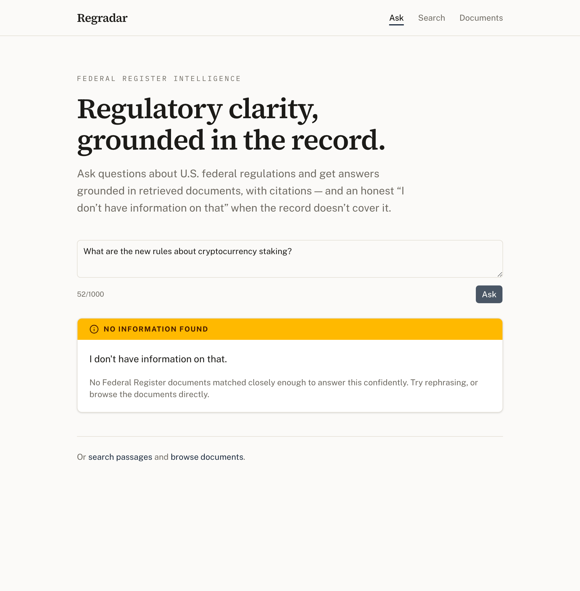

# Regradar

**Semantic search and grounded, cited AI answers over the U.S. Federal Register.**

Regradar makes federal regulations searchable in plain English and answers
questions about them — grounding every answer in real regulatory documents,
citing its sources, and saying honestly when it doesn't know.

## What it does

The U.S. Federal Register publishes hundreds of regulatory documents every
business day — proposed rules, final rules, and notices that carry real legal
and financial weight. Almost no one can practically monitor it, and small
businesses routinely get blindsided by rules that affect them.

Regradar ingests those documents and lets you:

- **Ask** a question in plain English and get an answer grounded in the actual
  regulatory text, with citations to the documents it used.
- **Search** the corpus semantically — by meaning, not just keywords.
- **Browse** documents with their agencies, types, and public-comment deadlines.

For a regulatory tool, being *trustworthy* matters more than being clever. The
most important design decision in Regradar is that it never pretends to know
something it doesn't.

## How it works

```
Federal Register API
        │  fetch
        ▼
  HTML cleanup + sanitization
        │
        ▼
  Structure-aware chunking         (split on a document's real sections)
        │
        ▼
  Embeddings (OpenAI, 1536-dim)    (behind a swappable Embedder interface)
        │
        ▼
  PostgreSQL + pgvector            (HNSW index, cosine similarity)
        │  semantic retrieval
        ▼
  RAG generation (Anthropic Claude)
        │
        ▼
  Cited answer  ·  or an honest "I don't have information on that"
```

Ingestion fetches documents, strips HTML and null bytes, chunks them in a
structure-aware way, embeds the chunks, and stores them in Postgres with a
pgvector HNSW index. A query is embedded and matched by cosine similarity; the
retrieved chunks become the grounding context for a Claude-generated answer that
cites the document numbers it used.

### Anti-hallucination by design

This is the part worth looking at. A regulatory assistant that invents a rule or
a deadline is worse than useless, so the system is built to refuse rather than
guess:

- **A similarity-threshold gate.** If nothing retrieved clears a relevance
  threshold, the LLM is *never called* — the system returns an honest "no
  information" answer instead of straining to answer from weak context.
- **Grounded only in retrieved chunks.** The generation prompt instructs the
  model to answer solely from the provided documents and to cite document
  numbers; it is not asked to rely on its own knowledge.
- **The same honesty on search.** Semantic search applies its own relevance
  floor, so an out-of-scope query returns *no matches* rather than a list of
  weak, misleading "results."
- **A consistent trust vocabulary.** Every response state is surfaced so a user
  can tell, at a glance, what they're looking at: **green** = a grounded answer,
  **amber** = an honest "no information / no match", **red** = an actual error.
  This was deliberately verified for a one-second, pre-reading distinction.

|  Grounded answer (green)  |  Honest decline (amber)  |
| :-----------------------: | :----------------------: |
|  |  |

*Screenshots are of the [Regradar frontend](https://github.com/vimalnakrani08/regradar-frontend),
which consumes this API.*

## Tech stack

- **Language:** Python 3.12, managed with [uv](https://github.com/astral-sh/uv)
- **API:** FastAPI (async), with a uniform error envelope and clean DTOs
- **Database:** PostgreSQL 16 + [pgvector](https://github.com/pgvector/pgvector)
  (HNSW index, cosine distance), via Docker
- **ORM / migrations:** SQLAlchemy 2 (async) + Alembic
- **Embeddings:** OpenAI `text-embedding-3-small` (1536-dim), behind a swappable
  `Embedder` protocol
- **Generation:** Anthropic Claude, behind a swappable `AnswerGenerator` protocol
- **Quality:** full `pytest` suite (HTTP mocked, transaction-rollback DB
  fixtures), `ruff` (lint + format), and `mypy --strict`

The architecture leans on a repository pattern for data access, dependency
injection for collaborators, and protocol-based interfaces so the embedding and
generation providers can be swapped without touching business logic.

## About this project

A personal / portfolio project, built to production-quality standards — fully
typed, tested, with database migrations and a clean, layered architecture —
rather than as a throwaway demo. It is developed locally and is not currently
deployed.

## Getting started

Prerequisites: Python 3.12, [uv](https://github.com/astral-sh/uv), and Docker
(for PostgreSQL + pgvector). You'll need an OpenAI API key (embeddings) and an
Anthropic API key (answer generation).

```bash
# 1. Install dependencies
uv sync

# 2. Configure secrets — copy the example and fill in your keys
cp .env.example .env   # then edit .env

# 3. Start PostgreSQL (pgvector) via Docker
docker compose up -d

# 4. Apply database migrations
uv run alembic upgrade head

# 5. Run the API
uv run uvicorn regradar.api.app:app --reload
```

The API serves at `http://localhost:8000`. Key endpoints:

| Method | Path                           | Purpose                              |
| ------ | ------------------------------ | ------------------------------------ |
| `POST` | `/ask`                         | Grounded, cited answer to a question |
| `GET`  | `/search?q=&limit=`            | Semantic search over document chunks |
| `GET`  | `/documents?limit=&offset=`    | Paginated document list              |
| `GET`  | `/documents/{document_number}` | Single document                      |
| `GET`  | `/health`                      | Liveness + database check            |

### Development

```bash
uv run ruff format .      # format
uv run ruff check .       # lint
uv run mypy src           # type-check (strict)
uv run pytest             # tests
```

## Related

- **[regradar-frontend](https://github.com/vimalnakrani08/regradar-frontend)** —
  the Next.js web client that consumes this API.

## License

MIT
